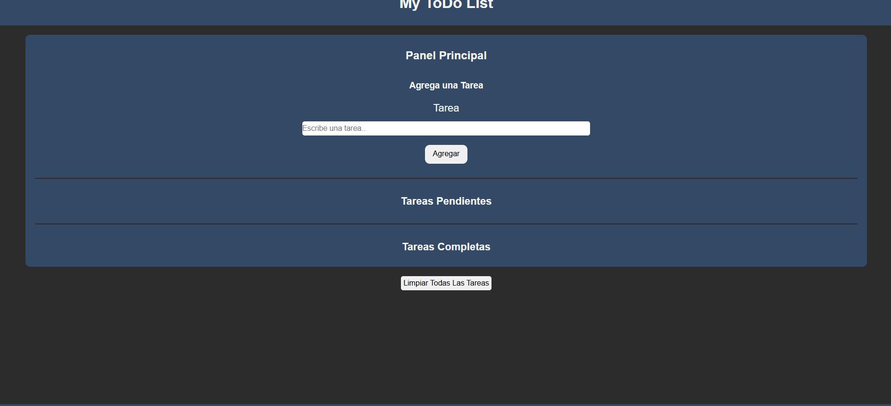

# ToDo List - With IndexedDB

Todo List creado desde 0, utilizando HTML, CSS, SASS, JS, Gulp, Librerias JS: SweetAlert2.

## Demo

* Sitio en vivo: [Ver proyecto](https://my-todo-list-koridormi.netlify.app/)
* Repositorio: [Ver código](https://github.com/Koridormi/ToDo-List)

## Vista previa

## Tecnologías utilizadas

* HTML5
* CSS3 / Sass
* JavaScript
* Gulp
* IndexedDB

## Funcionalidades

* Diseño responsive.
* Estructura semántica con HTML.
* Estilos organizados y reutilizables.
* Manipulación dinámica del DOM.
* Persistencia de datos en el navegador.
* Operaciones CRUD.

## Aprendizajes

Durante el desarrollo de este proyecto puse en practica lo siguiente:

* Organización de archivos.
* Maquetación responsive.
* Uso de Sass.
* Manipulación del DOM.
* Manejo de eventos.
* Modularización de JavaScript.
* Consumo o persistencia de datos.
* Buenas prácticas con Git y GitHub.

## Porque se uso IndexedDB?:

Se utilizo IndexedDB para entrenar y mejorar mi manejo con el mismo, lo mas recomendable y facil hubiese sido usar localStorage.

## Autor

Desarrollado por **Koridormi**.

* GitHub: [Usuario](https://github.com/Koridormi)
* LinkedIn: [Perfil](https://www.linkedin.com/in/koridormi/)
* Portfolio: [Portfolio](https://sebastian-web.netlify.app/)